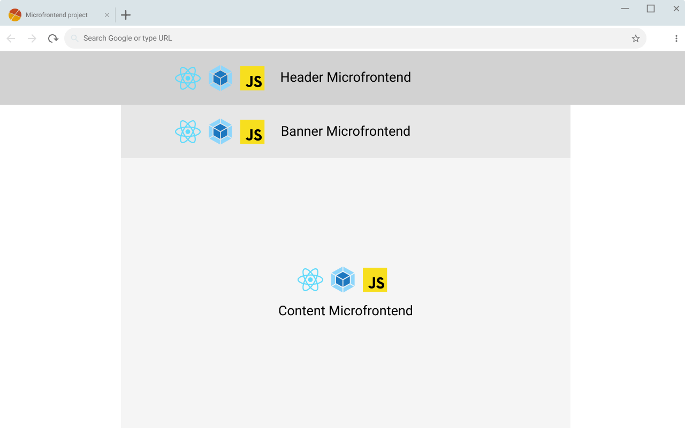

# Microfrontend project

The project is divided in 3 independents micro frontend projects;

- **Header microfrontend:** to expose menus and navigation contents options;
- **Banner microfrontend:** to marketing and merchandising ;
- **Content microfrontend:** site content and informations;

It was developed using javascript and react library, and build using webpack.

